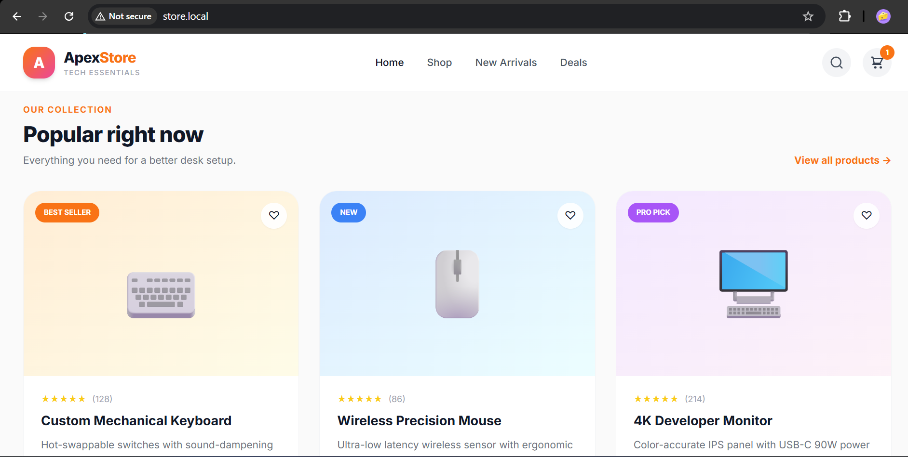
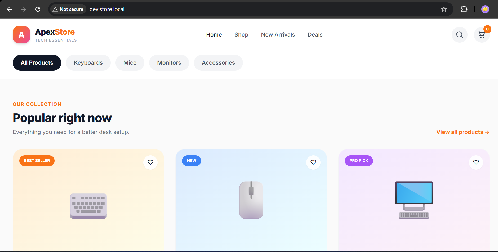
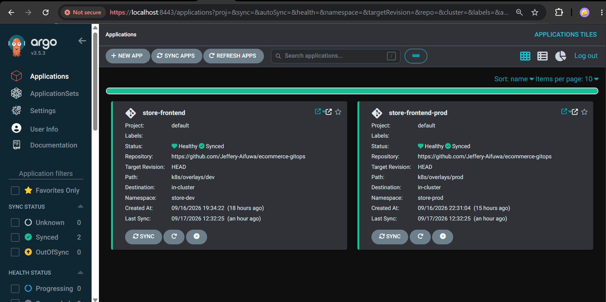
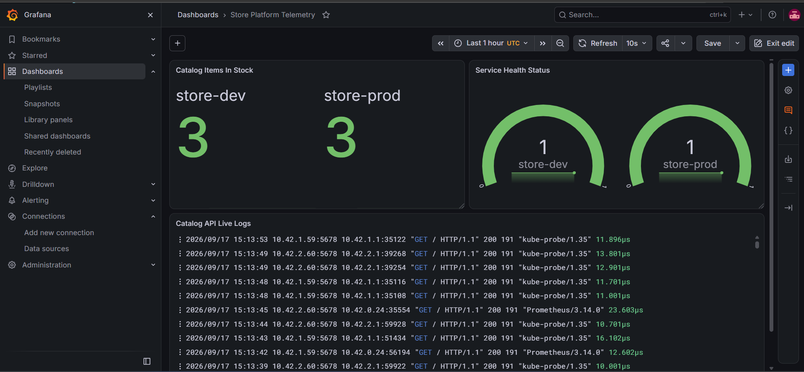
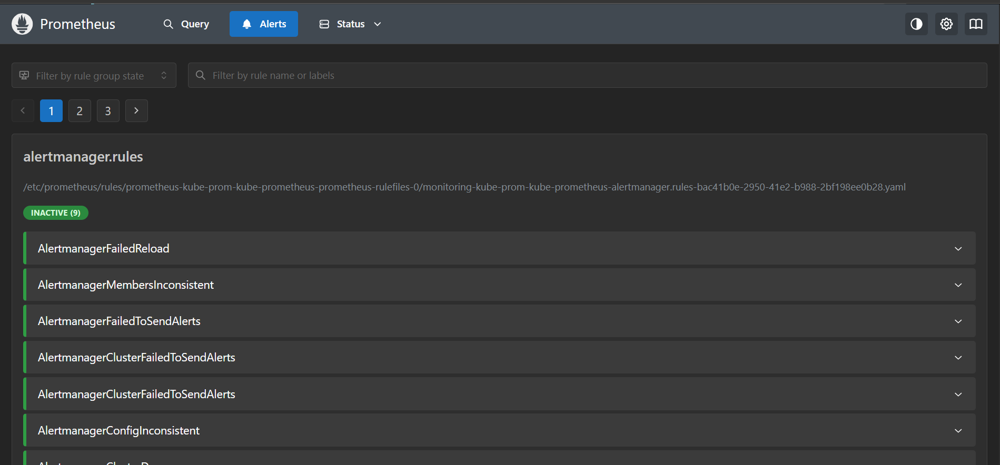
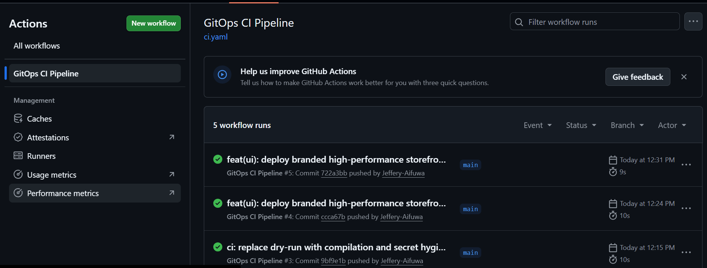
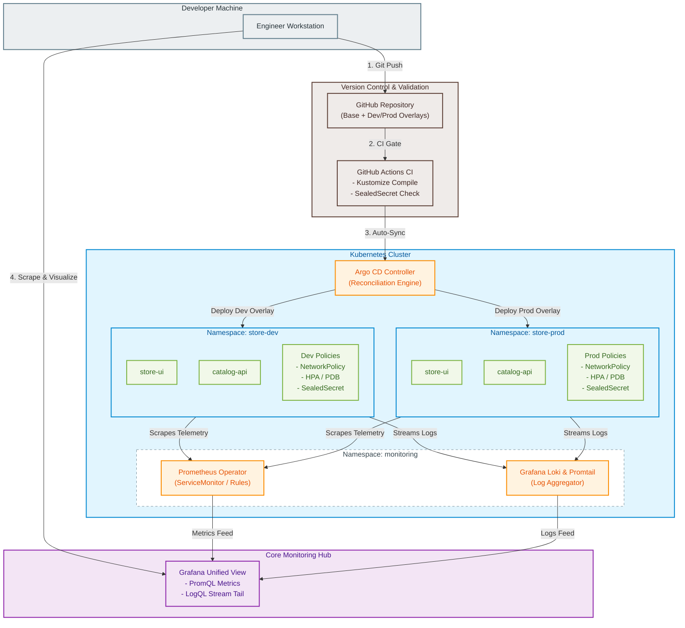

# Apex Cloud Store — Production-Grade GitOps Microservices Architecture

An enterprise-ready, declarative Kubernetes platform demonstrating multi-environment GitOps delivery, zero-trust container security, chaos-tested Prometheus/Loki observability, and automated CI hygiene pipelines.

## Platform Showcase

### 1. Dual-Environment Storefront UI
| Production (`http://store.local`) | Development (`http://dev.store.local`) |
| :---: | :---: |
|  |  |
| *Tailwind-powered catalog running in `store-prod`* | *Development overlay with live environment detection* |

### 2. GitOps Continuous Delivery (Argo CD)

*Declarative sync tracking both `store-dev` and `store-prod` with automated drift healing.*

---

### 3. Unified Observability & Log Streaming (Grafana)

*Real-time PromQL business gauges (`catalog_items_total`, `catalog_up`) correlated alongside LogQL container log streams via Loki & Promtail.*

### 4. Chaos-Tested Alerting Lifecycle (Prometheus)

*Dynamic `PrometheusRule` triggering `CatalogServiceDown` alert after synthetic fault injection.*

### 5. Automated Pre-Merge CI Hygiene (GitHub Actions)

*Automated Kustomize compilation, multi-overlay verification, and plain-text secret rejection gate.*

## System Architecture



## Tech Stack & Engineering Pillars

| Domain | Technology | Core Responsibilities |
|---|---|---|
| Orchestration | Kubernetes (k3d) | Local multi-node cluster runtime with Traefik ingress controller |
| Package Management | Kustomize | DRY configuration using a single base and parameterized dev/prod overlays |
| Continuous Delivery | Argo CD | Declarative GitOps control plane with automated self-healing and drift correction |
| Continuous Integration | GitHub Actions | Automated schema validation, multi-overlay dry-runs, and unencrypted secret linting |
| Secret Management | Bitnami Sealed Secrets | Asymmetric cryptography enabling safe GitOps versioning of sensitive credentials |
| Container Security | Kubernetes NetworkPolicies | Zero-trust intra-cluster firewalling isolating backend services from unauthorized pods |
| Metrics & Alerting | Prometheus Operator | Dynamic CRD discovery via ServiceMonitor and declarative PrometheusRule alerting |
| Centralized Logging | Grafana Loki + Promtail | Low-overhead label-indexed log aggregation across all namespaces and nodes |
| Unified Visualization | Grafana | Integrated dashboard visualizing PromQL business gauges and real-time LogQL streams |

## Security & Resilience Highlights
- Zero-Trust Network Policies: catalog-api rejects all inbound cluster traffic except explicit requests from store-ui and the Prometheus scraper running in the monitoring namespace.

- Sealed Secrets Engine: Secrets are encrypted client-side using kubeseal with cluster public keys. The private decrypting key never leaves the cluster runtime.

- Defense-in-Depth CI Checks: Pre-merge GitHub Actions enforce a negative regex check ensuring raw kind: Secret manifests can never be committed.

- Resilience Engineering: Configured Horizontal Pod Autoscaling (HPA) alongside Pod Disruption Budgets (PDB) to preserve minimum quorum availability during cluster node drains.

## Observability & Chaos Validation

- ServiceMonitor Scrape Targets: Prometheus queries backend services dynamically via Kubernetes custom resource definitions.

- Declarative Alerting: Deployed CatalogServiceDown (expr: catalog_up == 0, for: 1m) triggering automated severity alerts.

- Chaos Engineering Walkthrough: Validated the alert lifecycle by injecting synthetic fault payloads in store-dev:

    `Target Degraded` → `Alert Pending (15s)` → `Alert Firing (60s)` → `GitOps Revert` → `Auto-Resolved`

- LogQL Streaming: Real-time container stdout ingestion indexed by cluster labels (namespace, app, container).

## Quickstart & Verification

1. Ingress Hosts Mapping
- Add the following local DNS records to your /etc/hosts (Linux/macOS) or C:\Windows\System32\drivers\etc\hosts (Windows):

    ```
    127.0.0.1  dev.store.local
    127.0.0.1  store.local
    ``` 

2. Access Environments
- Production Storefront: http://store.local

- Development Storefront: http://dev.store.local

- Argo CD UI: http://localhost:8443

- Grafana Dashboard: http://localhost:3000 (User: admin)

- Prometheus Targets & Alerts: http://localhost:9090