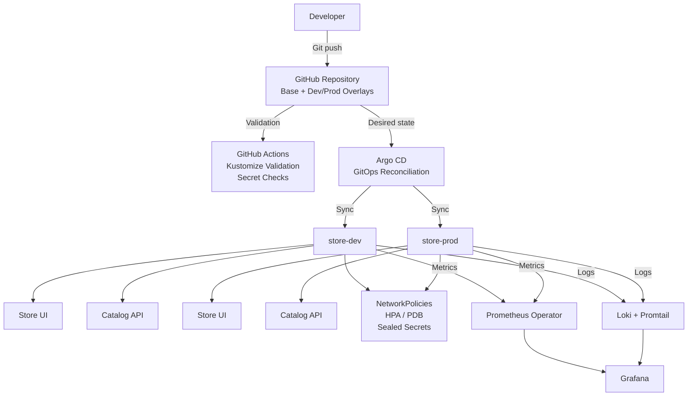

# Apex Cloud Store — GitOps Kubernetes Delivery Platform

A Kubernetes-based e-commerce platform built to demonstrate how application deployment, environment management, security, monitoring, logging, and failure recovery can be automated using modern DevOps practices.

The project uses Git as the source of truth. Instead of manually changing the Kubernetes cluster, configuration is stored in Git and Argo CD continuously reconciles the cluster with the desired state.

The platform includes separate development and production environments, automated CI validation, secret management, network security, autoscaling, monitoring, centralized logging, and a tested failure-recovery workflow.

## What Problem Does This Solve?

Managing a Kubernetes application manually becomes difficult as the application grows.

A typical team may need to answer questions like:

- How do we deploy changes consistently?
- How do we keep development and production configurations separate?
- How do we know if someone changed something directly in the cluster?
- How do we prevent secrets from being committed to Git?
- Which services are allowed to communicate with each other?
- How do we know when an application becomes unhealthy?
- How do we investigate a failure?
- How does the application respond when demand increases?
- What happens when part of the system fails?

This project demonstrates a practical approach to those problems using GitOps, Kubernetes, CI, security controls, and observability.

When the desired configuration changes:
```
Git → CI validation → Argo CD → Kubernetes
```

Argo CD continuously checks whether the Kubernetes cluster matches what is defined in Git. If the cluster drifts from the desired configuration, Argo CD can reconcile it automatically.

At the same time:
```
Kubernetes → Prometheus + Loki → Grafana
```

provides visibility into application health, metrics, and logs.

## System Architecture



## How the Platform Works

### 1. Developer changes the configuration  
Application and infrastructure configuration is stored in Git.  

The repository uses a Kustomize base and separate overlays for development and production.

```
k8s/
├── base/
├── overlays/
│   ├── dev/
│   └── prod/
``` 

This allows common Kubernetes configuration to be reused while environment-specific settings remain separate.

### 2. GitHub Actions validates the changes

Before configuration is accepted, GitHub Actions performs automated checks.  
The CI workflow validates:

- Kustomize manifests
- Development overlay compilation
- Production overlay compilation
- Kubernetes configuration
- Secret handling

The pipeline also checks for plaintext Kubernetes `Secret` manifests.

The goal is to catch configuration and security mistakes before they reach the cluster.

### Automated Pre-Merge CI Hygiene (GitHub Actions)

*Automated Kustomize compilation, multi-overlay verification, and plain-text secret rejection gate.*


### 3. Argo CD deploys the desired state

Argo CD watches the Git repository and compares the configuration in Git with what is running inside Kubernetes.  

When the desired state changes, Argo CD synchronizes the appropriate environment.  

This gives the deployment process a clear flow:
``` 
Git change
    ↓
GitHub Actions validation
    ↓
Argo CD detects desired-state change
    ↓
Argo CD synchronizes Kubernetes
    ↓
Application reaches desired state
```

Argo CD is also configured for automated synchronization and self-healing.

The cluster does not depend on someone manually running kubectl apply every time a configuration changes.

### GitOps Continuous Delivery (Argo CD)

*Declarative sync tracking both `store-dev` and `store-prod` with automated drift healing.*

## Multi-Environment Kubernetes

The application runs in separate namespaces:

- store-dev  
- store-prod

Both environments share common configuration through Kustomize while allowing environment-specific configuration through overlays.

This demonstrates how the same application can be managed consistently across environments without duplicating the entire Kubernetes configuration.

### Dual-Environment Storefront UI
| Production (`http://store.local`) | Development (`http://dev.store.local`) |
| :---: | :---: |
|  |  |
| *Tailwind-powered catalog running in `store-prod`* | *Development overlay with live environment detection* |

## Security

Security was treated as part of the platform rather than something added at the end.

### Sealed Secrets

Sensitive values should not be stored as plaintext Kubernetes Secrets in Git. This project uses Bitnami Sealed Secrets.

The workflow is:
```
Secret value
    ↓
kubeseal
    ↓
Encrypted SealedSecret
    ↓
Git
    ↓
Kubernetes
    ↓
Decrypted Secret inside cluster
```

The encrypted representation can therefore be version-controlled without committing the original secret value.

The cluster's private decryption key remains inside the cluster.

## NetworkPolicies

Kubernetes NetworkPolicies restrict which workloads are allowed to communicate with each other. For example, the `catalog-api` does not simply accept traffic from every workload in the cluster.

Traffic is explicitly allowed from the components that need access, including the store UI and the monitoring system. This provides an additional layer of isolation between workloads.

## Reliability and Scaling
### Horizontal Pod Autoscaler

The application includes Kubernetes Horizontal Pod Autoscaling (HPA).

The purpose is to allow Kubernetes to adjust the number of application replicas based on resource utilization rather than requiring a fixed replica count.

Conceptually:
```
Low workload
    ↓
Fewer replicas

Higher workload
    ↓
More replicas
```

## Pod Disruption Budget

A Pod Disruption Budget (PDB) is also configured.

The purpose is to protect application availability during planned disruptions such as node maintenance.

It helps ensure that Kubernetes does not voluntarily disrupt too many application replicas at the same time.

Together, HPA and PDB address different concerns:

| Component | Purpose |
|---|---|
| HPA | Adjusts capacity based on workload |
| PDB | Protects availability during voluntary disruptions |

## Observability

A platform is difficult to operate if you cannot see what is happening inside it. This project includes both metrics and logs.

### Prometheus

Prometheus collects application metrics from Kubernetes workloads.

The project uses the Prometheus Operator and `ServiceMonitor` resources to define scrape targets declaratively.

The application exposes metrics including:

- catalog_items_total
- catalog_up

This allows the monitoring system to answer questions such as:

Is the catalog service healthy? and How many catalog items are currently available?

### Prometheus Alerting

The project defines a `PrometheusRule` for the catalog service.

The `CatalogServiceDown` alert is triggered when `catalog_up == 0` for the configured duration. This converts application health information into an actionable alert.

## Centralized Logging

The project uses:

- Grafana Loki for log storage
- Promtail for collecting container logs
- Grafana for visualization

Instead of inspecting individual Kubernetes pods manually, logs from the workloads can be viewed centrally.

Logs can also be filtered using labels such as:

- namespace
- app
- container

This makes troubleshooting easier when multiple workloads are running across the cluster.

## Grafana

Grafana provides a unified view of the platform.

It brings together:

### Metrics

Using PromQL, dashboards can display application and infrastructure metrics.

### Logs

Using LogQL, container logs collected by Loki can be searched and viewed.

This allows application health and application logs to be investigated from the same monitoring interface.

### Unified Observability & Log Streaming (Grafana)

*Real-time PromQL business gauges (`catalog_items_total`, `catalog_up`) correlated alongside LogQL container log streams via Loki & Promtail.*

## Failure and Recovery Testing

Tested monitoring and GitOps recovery workflow by introducing a failure condition into the development environment.

The observed lifecycle was:
```
Target degraded
      ↓
Alert pending
      ↓
Alert firing
      ↓
GitOps reconciliation
      ↓
Desired state restored
      ↓
Alert resolved
```

The configured alert uses: `catalog_up == 0` with a one-minute firing duration.

This validates that the monitoring system could detect the simulated failure and that GitOps could restore the workload to the configuration defined in Git.

## CI/CD vs GitOps

An important design decision in this project is separating CI validation from CD/reconciliation.

### GitHub Actions

GitHub Actions answers:

“Is this configuration valid and safe to merge?”

It performs validation and checks before changes are accepted.

### Argo CD

Argo CD answers:

“Does the Kubernetes cluster match the desired state stored in Git?”

This separation gives each tool a clear responsibility:

```
GitHub Actions
      ↓
Validate

Argo CD
      ↓
Reconcile

Kubernetes
      ↓
Run
``` 

## Technology Stack
| Area | Technology | Purpose |
|---|---|---|
| Container orchestration | Kubernetes / k3d | Run the application workloads |
| Configuration management | Kustomize| Reuse configuration across environments |
| GitOps CD | Argo CD | Reconcile Kubernetes with Git |
| CI | GitHub Actions | Validate Kubernetes configuration |
| Secret management | Sealed Secrets | Securely manage secrets in GitOps |
| Network security | Kubernetes NetworkPolicies | Restrict workload communication |
| Autoscaling | HPA	| Dynamically adjust replicas |
| Availability |PDB	| Protect replicas during disruption |
| Metrics | Prometheus Operator	| Collect and manage metrics |
| Alerting | PrometheusRule | Define application alerts |
| Logging | Grafana Loki | Centralize container logs |
| Log collection | Promtail | Collect and forward logs |
| Visualization | Grafana | Display metrics and logs |
| Ingress | Traefik | Route traffic into the cluster |

## Running the Project

The project is designed to run locally using k3d.

### 1. Configure local hostnames

Add the following entries to your hosts file:

- 127.0.0.1 dev.store.local
- 127.0.0.1 store.local

On Windows:

`C:\Windows\System32\drivers\etc\hosts`

On Linux/macOS:

`/etc/hosts`

### 2. Access the environments

- Production Storefront: http://store.local

- Development Storefront: http://dev.store.local

- Argo CD UI: https://localhost:8443  
Port-forwarded: `kubectl port-forward -n argocd svc/argocd-server 8443:443`

- Grafana Dashboard: http://localhost:3000 (User: admin)

- Prometheus Targets & Alerts: http://localhost:9090